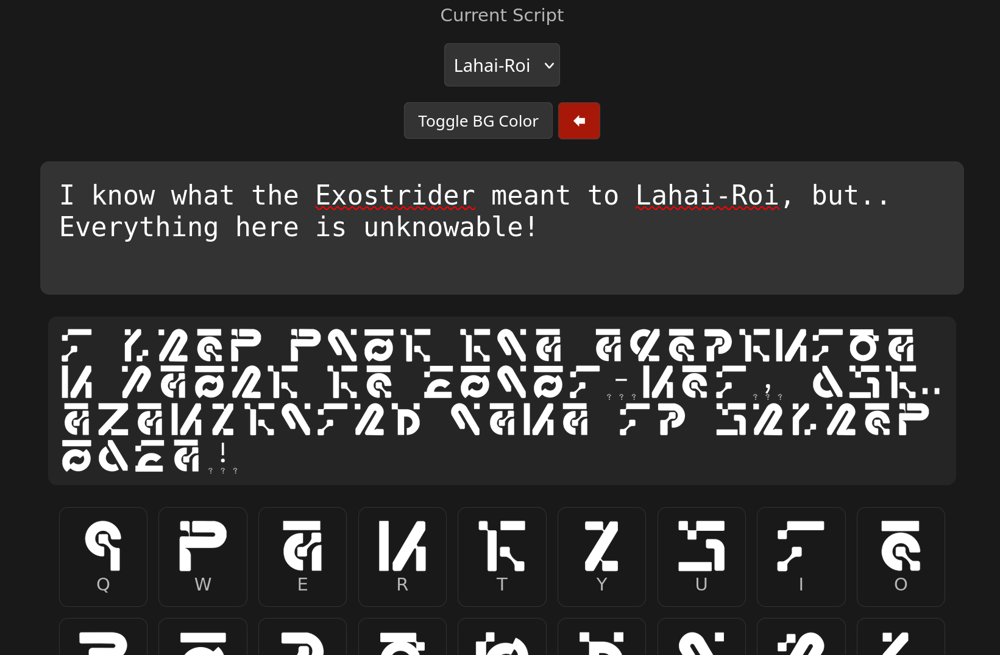

# Wuthering Waves Transliterator
This tool is created for the purpose of transliterating in-game text of Wuthering Waves.

   

Go to the live page: https://qubit69.github.io/ww-transliterator/

Features:
> Live preview of text-image and image-text

> Clickable reference chart for in-game text

> Toggleable background color for screencaps

> 3 scripts: Solaris, Ragunna and Lahai-Roi

-----

Currently working on:
`Septimont`
